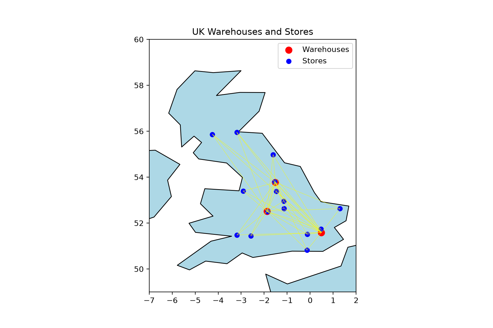
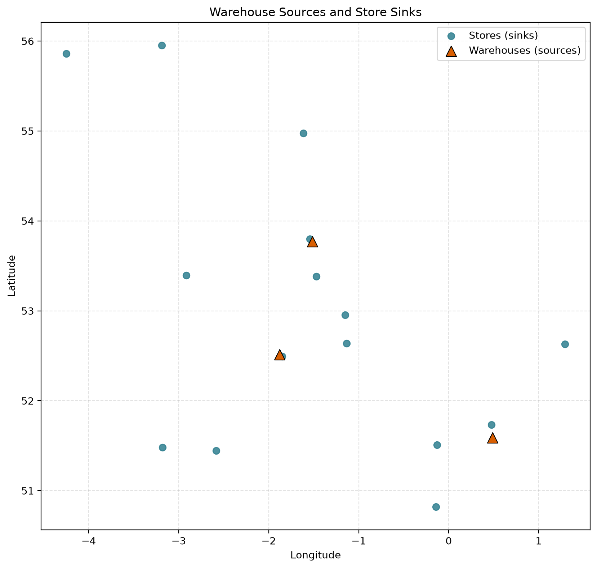
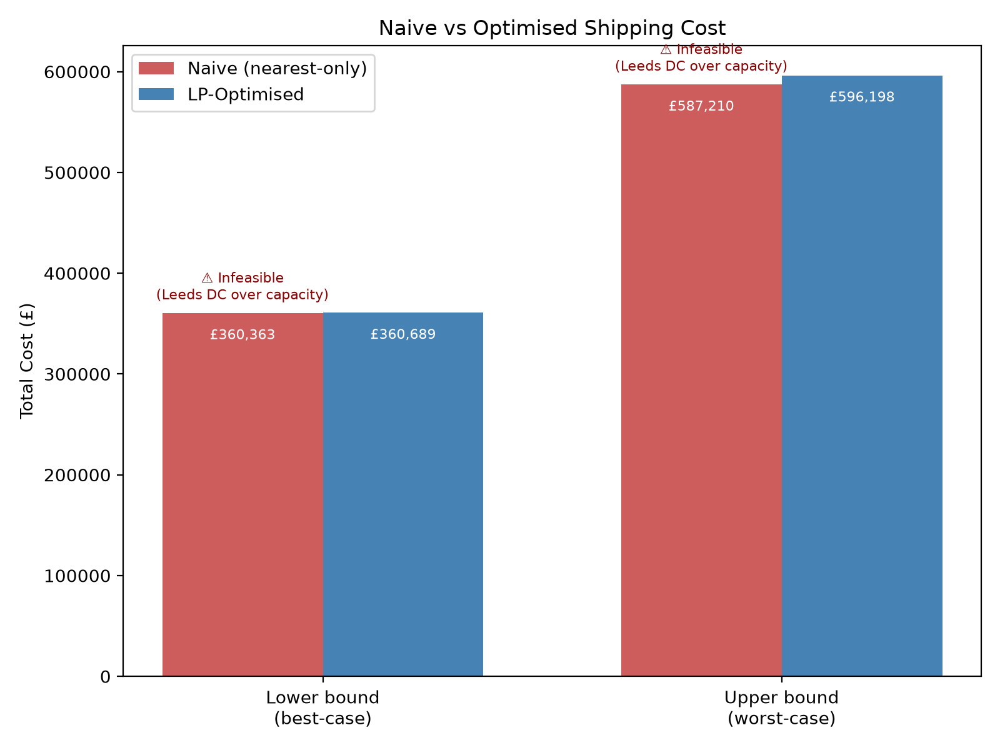
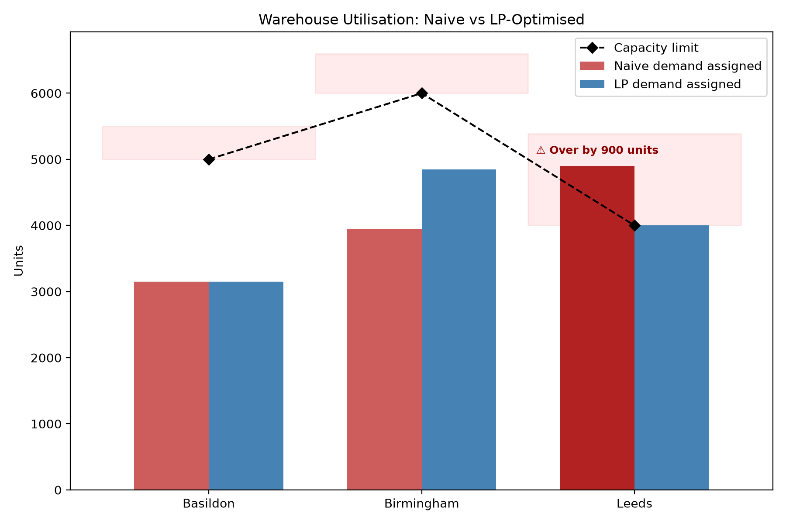

# UK Warehouse-to-Store Transportation Optimisation

A linear programming project that determines the cost-minimising shipment plan from 3 UK distribution centres to 15 stores, subject to warehouse capacity and store demand constraints. Solved with `PuLP`, using `geopandas`/`matplotlib` for geographic visualisation.

## Problem Setup

**3 warehouses (with capacity):**

| Warehouse | Capacity |
|---|---|
| Basildon Distribution Centre | 5,000 |
| Birmingham Distribution Centre | 6,000 |
| Leeds Distribution Centre | 4,000 |
| **Total** | **15,000** |

**15 stores (with demand)**, total demand = 12,000 units — confirming the problem is feasible before any solving takes place (total capacity > total demand).

**Cost model:** distance between each warehouse-store pair is computed using the **haversine formula** (great-circle distance from latitude/longitude), then converted to cost at **£0.45/km**. Since haversine gives straight-line distance rather than real road distance, two cost scenarios are modelled:

- **Lower bound** — cost using raw haversine (straight-line) distance; the optimistic/best-case estimate
- **Upper bound** — cost inflated by a circuity factor to approximate real road distance; the pessimistic/worst-case estimate

## Methodology

### 1. Naive Baseline

Each store is assigned to its single **geographically nearest** warehouse, ignoring cost and capacity entirely. This establishes a "what if we didn't optimise" comparison point.

### 2. LP Formulation (Standard Form)

**Minimise:**
$$\sum_{i=1}^{3} \sum_{j=1}^{15} c_{ij} x_{ij}$$

**Subject to:**
$$\sum_{j=1}^{15} x_{ij} + s_i = \text{capacity}_i \quad \forall i \in \{1,2,3\} \text{ (warehouses)}$$
$$\sum_{i=1}^{3} x_{ij} - e_j = \text{demand}_j \quad \forall j \in \{1,...,15\} \text{ (stores)}$$
$$x_{ij}, \, s_i, \, e_j \geq 0 \quad \forall i,j$$

Where $x_{ij}$ is the quantity shipped from warehouse $i$ to store $j$, $c_{ij}$ is the cost per unit for that route, $s_i$ is slack (unused capacity), and $e_j$ is surplus (demand met beyond the minimum).

Solved twice — once minimising on `upper_cost`, once on `lower_cost` — to bound the true cost given road-distance uncertainty.

### 3. Dual Problem

Let $u_i$ be the dual variable for warehouse $i$'s capacity constraint, and $v_j$ the dual variable for store $j$'s demand constraint.

**Maximise:**
$$\sum_{i=1}^{3} \text{capacity}_i \cdot u_i + \sum_{j=1}^{15} \text{demand}_j \cdot v_j$$

**Subject to:**
$$u_i + v_j \leq c_{ij} \quad \forall i,j$$
$$u_i \leq 0 \quad \forall i$$
$$v_j \geq 0 \quad \forall j$$

**Interpretation:**
- $u_i$ is the shadow price of capacity at warehouse $i$ — the marginal change in total cost from one extra unit of capacity there.
- $v_j$ is the shadow price of demand at store $j$ — the marginal change in total cost from one extra unit of demand there.
- By complementary slackness, $u_i \neq 0$ only where warehouse $i$'s capacity is fully utilised in the optimal solution — only **Leeds DC** met this condition (see Results).

## Results

### Naive vs. Optimised Cost

| Scenario | Naive (nearest-only) | LP-Optimised |
|---|---|---|
| Lower bound (best-case) | £360,363.10 ⚠️ *infeasible* | £360,689.00 |
| Upper bound (worst-case) | £587,209.67 ⚠️ *infeasible* | £596,198.21 |

The naive plan appears cheaper on paper, but is **not achievable in practice**: it assigns 4,900 units to Leeds DC, which only has 4,000 units of capacity — a 900-unit (22.5%) overload. The LP-optimised plan is the **cheapest cost that is actually deliverable**.

The premium paid for feasibility over the (unusable) naive plan is small: **£326** at the lower bound, **£8,988** at the upper bound — under 0.1%–1.5% of total cost, showing that respecting real-world constraints costs very little relative to the (invalid) naive estimate.

### Warehouse Utilisation (Optimal Solution)

| Warehouse | Capacity | Used | Utilisation |
|---|---|---|---|
| Basildon | 5,000 | 3,150 | 63% |
| Birmingham DC | 6,000 | 4,850 | 81% |
| Leeds DC | 4,000 | 4,000 | **100% — binding** |

Leeds DC is the only capacity-binding constraint in the optimal solution (in both cost scenarios), meaning it is the network's bottleneck — the warehouse to prioritise if capacity is ever expanded.

### Allocation Robustness

The optimal **allocation** (which warehouse serves which store) is **identical** across both the upper-bound and lower-bound cost scenarios — only the total £ figure changes. This means the recommended shipping plan is robust to uncertainty in road-distance estimation, even though the total cost estimate is not.

## Visualisations

**Warehouse and store locations, UK map**

**Optimal shipment network** — routes and volumes between warehouses and stores

**Naive vs. Optimised cost comparison** — flagging the naive result as infeasible

**Warehouse utilisation** — naive vs LP-optimised, with the Leeds DC capacity violation highlighted

## Tech Stack

`pandas`, `numpy`, `geopandas`, `matplotlib`, `PuLP` (CBC solver)

## Key Takeaway

Optimisation here isn't about a dramatic cost saving over a naive approach — it's about the difference between a plan that merely *looks* cheap and one that is **actually deliverable**. The naive nearest-only heuristic breaks down under real capacity constraints; the LP guarantees feasibility while adding only a small cost premium, and its recommended routing is stable even under uncertainty about real road distances.
